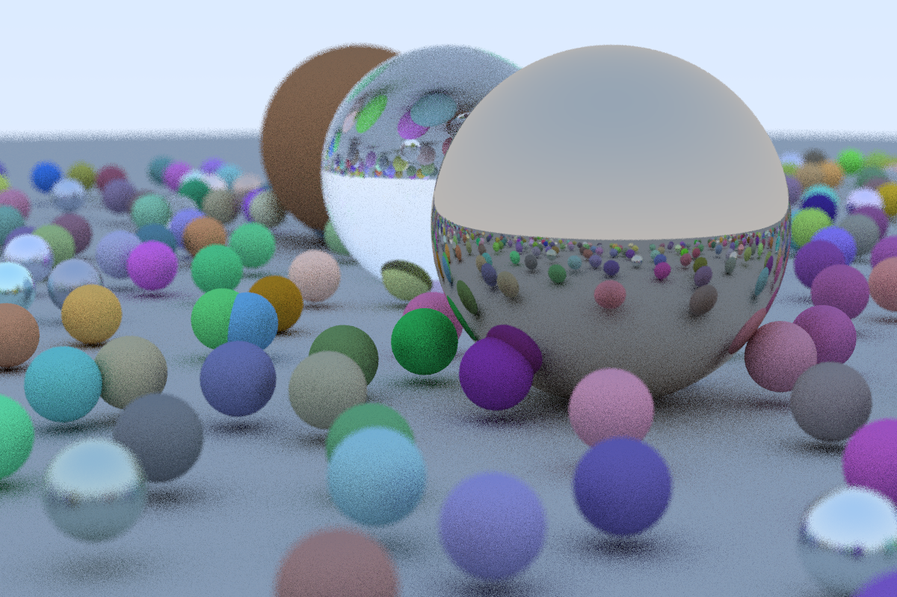

Ray Tracing Implementation using Python
=======================================

Didactic ray tracing implementation using Python ported from [Ray Tracing in One Weekend](https://github.com/RayTracing/raytracing.github.io) by Peter Shirley.

Quickstart
----------
Simply clone the repository and run one of the examples using Python from the *examples* subfolder. The implementation requires the [numpy](https://pypi.org/project/numpy/) and [imageio](https://pypi.org/project/imageio/) packages.

About
-----
Written by Christian B. Mendl around fall 2018
